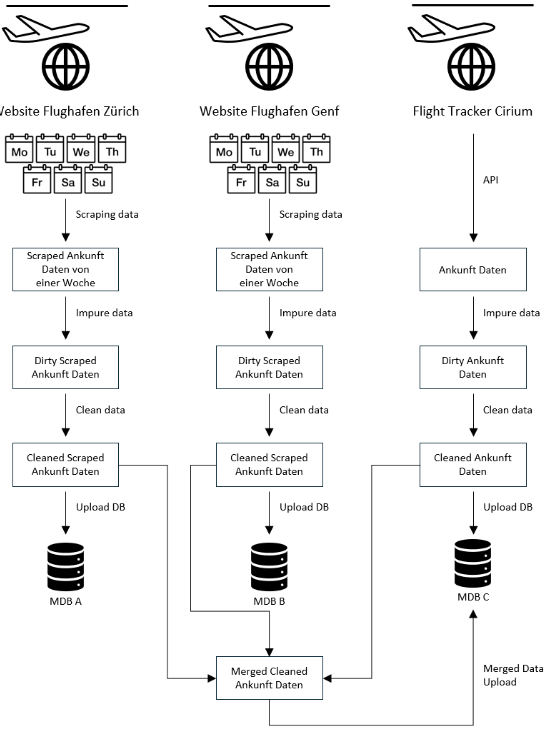

<!-- This Readme file is based on the template found here: https://github.com/othneildrew/Best-README-Template/blob/main/BLANK_README.md  -->

<!-- PROJECT LOGO -->
 

  

# Flight Data Scraping and Analysis: Exploring Arrival Time Discrepancies

<!-- TABLE OF CONTENTS -->
<li><a href="#about-the-project">About The Project</a></li>
<li><a href="#project-idea">Project Idea</a></li>
<li><a href="#data-sources">Data Sources</a></li>
<li><a href="#Process Workflow">Process Workflow</a></li>
<li><a href="#results">Results</a></li>

# About The Project
This project investigates discrepancies in flight arrival data between the published schedules of Swiss airports (Geneva and Zurich) and a reliable single source of truth (CIRIUM FlightStats). The primary objective is to analyze the accuracy and reliability of the data provided by the airports, focusing on measurable differences in arrival times and patterns in flight delays.

While the report includes analyses for both Geneva and Zurich airports, this repository provides only the technical implementation and files for Geneva Airport.

# Project idea
The project addresses the following key research questions:

- Are there measurable discrepancies between the arrival times published by Geneva and Zurich airports compared to CIRIUM FlightStats?
- What are the delay patterns across time, such as during different periods of the day or across weekdays?

The Geneva Airport data was processed and analyzed using web scraping, data cleaning, and visualization techniques. 
This repository showcases the implementation of the Geneva Airport analysis, serving as a reproducible framework for further investigations.

# Data Sources
This repository uses the following data sources for Geneva Airport:

**Geneva Airport (GVA):**
- Publicly available flight arrival schedules from [Geneva-Aiport] website.
- Data is scraped daily due to limited availability (24 hours).

**Zurich Airport (ZRH):**
- References similar data sources and methodology, but the implementation is not included in this repository.

**CIRIUM FlightStats API:**
- A trusted data source providing flight arrival times at the runway and gate level.

Data from April 1 2024 to April 7 2024 was collected for Geneva Airport and stored in structured formats for analysis.

# Process Workflow
The workflow implemented for Geneva Airport data includes the following steps:

**1. Extract:**
- Automated daily scraping of Geneva Airport’s flight arrival schedules using Selenium.
- Data saved in JSON format, focusing on arrival times and flight numbers.

**2. Transform:**
- Data cleaning and transformation performed with Pandas, including:
    - Handling missing values.
    - Matching airline codes for standardization.
    - Restructuring JSON data into tabular formats.
- The final dataset includes additional derived fields like gate delay and runway delay.

**3. Load:**
- The cleaned and processed data was stored in a MariaDB database for further analysis.
- Visualizations and statistical summaries were generated from the final dataset.

# Results
**1. Punctuality Based on Departure Airports**

The first research question examines the punctuality of flights based on their departure airports. 
The analysis compared the mean delays of the top five departure airports with the lowest and highest average delays for Geneva and Zurich.

  
View Screenshot

  
  - **Geneva Airport**:
    - No clear patterns emerged among specific departure airports.
    - High-traffic destinations such as Paris (CDG) and Lisbon (LIS) reported higher average delays.
  - **Zurich Airport**:
    - U.S. destinations like Miami (MIA), Washington (IAD), and New York (JFK) had the lowest average delays, likely influenced by favorable jetstream conditions.
    - Dubai (DXB) exhibited significant delays, possibly due to weather or operational factors.

  

**2. Quality and Consistency of Airport Data**

This research question explores the quality and consistency of flight arrival data reported by Geneva and Zurich airports compared to CIRIUM FlightStats.

  
View Screenshot

  
  - **Systematic Discrepancies**:
    - **Geneva**:
      - Runway: Underestimation of delays (slope = 0.96, intercept = -0.65 minutes).
      - Gate: Underestimation of delays (slope = 0.94, intercept = -3.35 minutes).
    - **Zurich**:
      - Runway: Overestimation of delays (slope = 0.99, intercept = 5.16 minutes).
      - Gate: Overestimation of delays (slope = 0.99, intercept = 0.21 minutes).
  
  - **Correlation Analysis**:
    - Geneva and Zurich both showed strong correlations with CIRIUM data:
      - Zurich Runway: 0.95 | Zurich Gate: 0.99
      - Geneva Runway: 0.96 | Geneva Gate: 0.94
    - While generally reliable, Geneva's gate data showed slightly lower consistency.
  
  

**3. Patterns in Delayed Flights**

The third research question analyzes patterns in delays, focusing on variations by weekday and time of day.

  
View Screenshot

  
  - **Daily Patterns**:
    - Both Geneva and Zurich airports showed consistent delay distributions across weekdays, with no significant differences.
  
  - **Hourly Patterns**:
    - Morning flights had the fewest delays, while delays increased steadily throughout the day at both airports.
    - Outliers occasionally influenced the averages, such as a notable early arrival in Zurich (19 minutes ahead of schedule).
  
  
  

<!-- MARKDOWN LINKS & IMAGES -->
[Geneva-Airport]: https://www.gva.ch/de/Site/Passagers/Vols/Informations/Arrivees